# VibeFlow

[中文](README.md)

> Keep AI-built projects from turning into an unmaintainable pile of mud.

VibeFlow forces AI to plan the program's rough architecture before development, and automatically generates a directly readable standard program flowchart from the program's **real code logic** so developers can understand the real structural logic of each part instead of guessing from AI descriptions that may be distorted. VibeFlow forces AI to follow high cohesion, low coupling, small files, small functions, explicit flow edges, and checkable contracts. AI can still move fast, but every edit must return to a visual, verifiable, runnable flowchart.

## Why VibeFlow 🧯

LLMs are great at writing code quickly. Across many rounds of edits, they are also great at quietly creating these problems:

- One function keeps growing until nobody wants to touch it.
- New features bypass existing structure and add hidden dependencies.
- Bug fixes become local patches while the root cause stays alive.
- The project architecture gradually becomes bloated and chaotic until AI itself can no longer understand it.

Eventually the code may still run, but the structure is no longer reviewable, new features are hard to add, and bugs become hard to fix.

VibeFlow moves these risks earlier. Before AI writes code, the project already carries executable rules for structure, contracts, flow, and artifacts.

## In One Sentence 🧭

VibeFlow constrains a project into a runnable, checkable, visual standard flowchart.

```text
terminal start -> io input -> process -> decision -> process -> io output -> terminal end
```

AI still writes business code, but it must work through the flowchart: each node stays small, control flow comes only from config, and every run starts with health checks.

## Showcase ✨

This SVG was exported from a complete integration sandbox example. Throughout AI development, developers can inspect the latest flowchart generated under `reports/` at any time to understand the project's current logical structure and keep track of the whole project state with minimal effort.



## Who It Is For 👥

- Developers using OpenCode, Codex, Claude Code, or other vibe coding tools for long-running projects.
- Teams that want AI assistance without losing project structure.
- Projects where business flow should be reviewable as Mermaid, ASCII, or SVG diagrams.
- Workflows that need automatic structure, contract, and quality checks before execution.

## Usage 🚀

VibeFlow is designed for release-package usage.

1. Download the latest package from GitHub Releases.
2. Extract it into your workspace.
3. Open or create a project in that directory with any vibe coding tool, such as OpenCode, Codex, or Claude Code.
4. Let AI follow `AGENTS.md` and classify the task first: for an existing project, read the registered architecture document and modify the real workflow/nodeset in place; only a greenfield project starts from a coarse planned flowchart.
5. Generate the formal architecture review artifact with `python run.py review`. If you asked for implementation only after review, AI must wait for your explicit approval in a later message.

The release package root includes `AGENTS.md`. AI tools that support project instructions can read it automatically and learn:

- Which directories are editable.
- Which kernel files should not be modified.
- How to add nodes, nodesets, and plugins.
- How to run validate, run, quality, and diagram commands.
- How to read and regenerate `ARCHITECTURE.jsonc` without editing it by hand.
- Which health checks must pass before execution.
- How to distinguish greenfield work from changes to an existing project and edit the real sources.
- How to generate a formal review with `review` and wait for explicit human approval before implementation.

You do not need to understand the full kernel source first. Treat the release package as an AI development workspace with built-in rules.

## Typical Release Package Layout 📦

```text
project/
  ARCHITECTURE.jsonc # generated single-file architecture review view
  nodes/          # business nodes
  base_lib/       # pure helper functions
  plugins/        # optional policy/runtime plugins
  configs/        # JSONC flow configs
  registry.py     # node registration
kernel/
  vibeflow/       # VibeFlow kernel copy, usually not edited
AGENTS.md         # project rules for AI tools
run.py            # project entrypoint
```

Common commands:

```bash
python run.py architecture --config project/configs/main.jsonc --output project/ARCHITECTURE.jsonc
python run.py architecture --config project/configs/main.jsonc --output project/ARCHITECTURE.jsonc --check
python run.py review --config project/configs/main.jsonc --output reports/graph.expanded.svg
python run.py validate --config project/configs/main.jsonc
python run.py run --config project/configs/main.jsonc --run-root runs
python run.py mermaid --config project/configs/main.jsonc --output reports/graph.mmd
python run.py ascii --config project/configs/main.jsonc --output reports/graph.txt
python run.py svg --config project/configs/main.jsonc --output reports/graph.svg
python run.py svg --config project/configs/main.jsonc --expand-nodesets --output reports/graph.expanded.svg
python run.py quality --path project
```

Each root can register workflow/document pairs under `architecture.documents` in `vibeflow_project.jsonc`. Fixed comments mark the generated document as non-executable; mutable-looking status properties are deliberately absent. AI should read it first to understand the project architecture. To change that architecture, edit the real workflow config or relevant nodesets, update registry metadata/config schema when needed, and regenerate the document; never edit the generated document itself. Workspace validation and execution reject a registered document that is missing, stale, or manually reformatted, with source locations and a repair command.

`review` is the formal architecture-review entry point. It checks registration and the existing graph, refreshes and verifies the canonical `ARCHITECTURE.jsonc`, runs workspace validation, then generates and checks an expanded `review-columns` SVG. If any stage fails, it does not substitute an old SVG, a hand-written diagram, or a direct mmdc render, and it does not publish the failed artifact to the target path. `PASS` or `CONCERNS` only means that machine review completed; when the task says “implement after review,” explicit human approval in a later message is still required.

The same root config can set `runtime.async_max_workers` (default 4), `runtime.async_flush_timeout` (default `null`), and `runtime.nodeset_max_depth` (default 4). Each Runtime owns its thread pool; ordinary nodeset calls and `loop.body` share the static depth limit, while loop iteration count does not increase it. Worker count and nodeset depth have no CLI flags.

The `svg` command internally passes an expanded render config to the bundled Mermaid CLI. Mermaid CLI/mmdc is a kernel implementation detail, not a public review entry point. Normal graphs default to `maxTextSize=200000`; `--expand-nodesets` defaults to `maxTextSize=500000`. Very large graphs can override this with `--mermaid-max-text-size` and `--mermaid-max-edges`.
Expanded SVG exports always use the deterministic `review-columns` composer: the main pipeline stays on the left, followed by plugins, base_lib, and expanded nodesets in top-level call order. Nodeset details use a recursive detail-panel layout: leaf nodesets render horizontally; parents with child nodesets keep collapsed call-sites and original edges, with direct child nodesets stacked to the right in call order.
`graph.expanded.mmd` is a Mermaid source debug artifact only. Do not render it directly with Mermaid CLI/mmdc. Formal architecture review must use `run.py review`; `run.py svg --expand-nodesets` remains a single-artifact export or diagnostic entry point.
SVG rendering does not require Google Chrome to be preinstalled. After a normal `npm install`, VibeFlow first uses Puppeteer's installed/cached browser. `/snap/bin/chromium` is skipped because it commonly fails under Puppeteer/mermaid-cli with profile-lock launch errors.

## AI Development Workflow 🛠️

Classify the task first, then follow the matching path:

```text
Modify an existing project
  -> Read the registered ARCHITECTURE.jsonc
  -> Locate the real workflow / nodeset sources referenced by it
  -> List reused / modified / deleted / added objects
  -> Make the smallest change in the original config and nodesets
  -> run.py review -> explicit later human approval -> implement -> validate / quality / run

Create a greenfield project
  -> Abstract a coarse standard flowchart
  -> Write planned nodesets into the real JSONC
  -> run.py review -> explicit later human approval
  -> Implement node / base_lib / plugin / config in stages
  -> validate / quality / run
```

An existing workflow is modified in place by default. A parallel review config, hand-written Mermaid, conceptual diagram, or vague delta picture cannot replace review of the real config. Only a greenfield project or a full redesign explicitly approved by a human starts from a new coarse planned topology. A planned nodeset may omit its body or include a progressively refined body. That body appears in the architecture document, expanded diagrams, and applicable static checks, but it is not executed as an implemented body. A `python_stub` nodeset remains one stub call; an implemented nodeset requires a complete pipeline.

VibeFlow does not stop you from vibe coding. It makes every vibe return to a checkable structure.

## How It Works ⚙️

VibeFlow is a strict flowchart runtime. Nodes handle local pure computation, JSONC config declares control flow, the compiler builds an executable graph, and the health checker blocks structural drift and contract errors before runtime.

It turns project architecture from a verbal convention into executable checks.

## Core Features 🧩

### Standard Flowchart Constraints

Every node declares a standard `flow_kind`:

- `terminal`: start / end.
- `process`: normal processing.
- `decision`: branch / route.
- `io`: input / output action.
- `predefined`: predefined process / nodeset.
- `data_store`: data store request or reference.
- `document`: document generation or document structure.
- `preparation`: setup / initialization.

`flow_kind` declares architecture semantics, diagram shape, and applicable checks; it does not grant file, network, database, or process permissions. This means AI-written code must not only run; it must fit back into a reviewable flowchart.

### Explicit Flow Edges

Program control flow comes only from `pipeline.edges` in JSONC config.

`requires` / `provides` are data contracts, not hidden control-flow inference. This keeps multi-round AI edits from creating implicit paths and invisible dependencies.

Data contracts use strict structured fields: `provides` declares a unique `key` and logical `type`, while `requires` consumes by `type` plus `cardinality`. Runtime passes envelopes through node inboxes and edge payloads; nodes cannot read early upstream outputs through a multi-hop global Context, and final results keep only `pipeline.outputs`.

### Small Nodes And Pure Logic

Business nodes are pure by default:

- No file reads or writes.
- No network access.
- No database access.
- No browser or external process launches.
- No environment variable reads.
- No direct calls to other nodes.

An `io` node only adapts an external representation already passed in or forms an output object; `data_store` and `document` nodes only form storage requests, references, or document objects. The caller or an adapter outside the kernel performs real file, network, database, and process side effects. Third-party or externally maintained code is marked with `NodeInfo.external=True`; this is a source-maintenance and inspection boundary, not an IO permission or purity bypass.

### Pre-Run Health Checks

Before execution, VibeFlow checks:

- Node metadata completeness.
- Input and output contracts.
- Reachability from start to end.
- Whether ordinary graph/nodeset cycles are absent; iteration must use the first-class `vibeflow.loop.while` node.
- Node purity and structure rules.
- Whether config, plugins, or nodesets break project boundaries.

If checks fail, the run is refused with traceable reasons.

### Visual Artifacts

The same config can export:

- Mermaid flowcharts.
- ASCII terminal flowcharts.
- SVG diagrams.

Humans can review the system shape, and AI tools get a clearer project map.

## Repository Docs 📚

- `docs/kernel_target_vision.md`: vision.
- `docs/developer_guide.md`: user development guide.
- `docs/kernel_development_guide.md`: VibeFlow maintenance guide.
- `docs/strict_flowchart_kernel_redesign.md`, `docs/11_*.md`, `docs/12_*.md`, `docs/13_*.md`: historical design records and staged plans, not the current public API.
- `distribution/kernel_development_pack/`: release package template.

## License 📄

VibeFlow is licensed under the GNU Affero General Public License v3.0 (AGPLv3). See `LICENSE`.

## Status 🚧

VibeFlow is evolving quickly. The current focus is stabilizing structure discipline, flowchart representation, pre-run checks, and the release-package experience for AI-assisted development.

If more software will be maintained by humans and AI together, projects need more than stronger generation. They need harder structural boundaries.

VibeFlow is that boundary.
