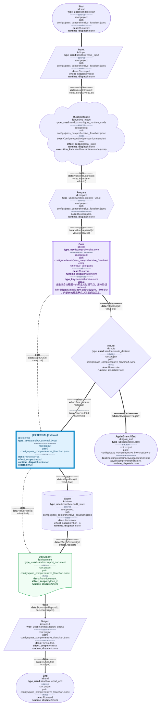

# VibeFlow

[中文](README.md)

VibeFlow structures AI-assisted programs as explicit workflows that can be executed, checked, and rendered as architecture views. Business logic lives in small Nodes, Config declares control flow, port contracts declare data flow, and Core validates the structure before execution or build.

```text
terminal start → input I/O → process / nodeset → output I/O → terminal end
```



## Main capabilities

- Python Runtime and JavaScript/TypeScript AOT;
- Nodes, Nodesets, Loops, Plugins, Capabilities, and explicit effect boundaries;
- deterministic Architecture, Mermaid, ASCII, and SVG views;
- config, contract, reachability, control-flow, quality, build, and execution-evidence checks;
- collaborative and autonomous development protocols over the same Core and machine rules.

VibeFlow validates engineering structure. Project tests remain responsible for business results, requirements, external semantics, and domain-data correctness.

## Getting started

Download and extract one release package:

- `vibeflow-distribution-0.13.2.zip` for human-reviewed collaboration;
- `vibeflow-distribution-autonomous-0.13.2.zip` for unattended development.

The root `AGENTS.md` routes AI agents to task-specific documentation. Human readers can start at `kernel/docs/README.md`. Both packages include minimal `python_project/` and `javascript_project/` roots.

Python smoke run:

```bash
python run.py validate --config python_project/configs/main.jsonc
python run.py run --config python_project/configs/main.jsonc --input python_project/probe_input.json
```

JavaScript smoke run:

```bash
npm ci --prefix javascript_project
python run.py build --config javascript_project/configs/main.jsonc --target node --profile esm-module --out-dir javascript_project/build/node
node javascript_project/scripts/workflow_execution_probe.mjs
```

## Documentation

- [Project overview](docs/overview.md)
- [User development guides](docs/README.md#使用者开发)
- [System design](docs/README.md#系统设计)
- [Kernel maintenance](docs/README.md#内核维护)

Run the complete source-repository gate with:

```bash
python tools/verify_project.py --full
```

Current package version: `0.13.2`. Workflow ABI: `vibeflow.workflow.v4`.
