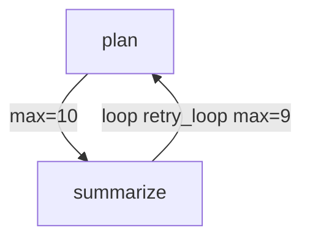
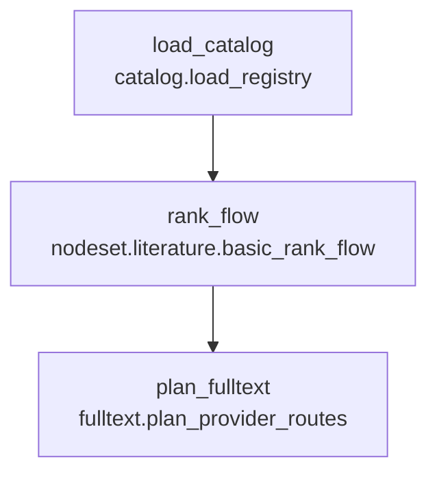
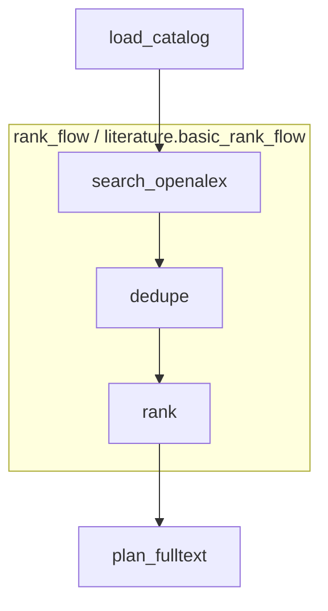

# 具备严格纯函数节点治理的可迁移拓扑内核

## 目标

这个内核首先面向人机协同开发，特别是 LLM 深度参与编码、修改和维护的项目。它要解决的不是“如何让代码更容易写”，而是“如何让 LLM 写出的代码长期不失控”。

LLM 常见风险包括：

- 倾向于把功能不断写大。
- 倾向于在局部叠补丁，而不是修复根因。
- 容易引入隐式依赖、跨 node 调用和隐藏副作用。
- 多轮修改后，代码仍能运行，但结构已经难以维护。

因此，内核必须把架构纪律变成机器可检查的硬限制。使用者不应该主要依赖人工审查来判断 node 是否高内聚、低耦合、足够小；这些要求应由策略、验证器、编译器和运行时共同执行。

将 Paperflow 当前 ERA-style 框架内核抽象成一个可迁移基础包。该基础包可以复制到新项目，或未来独立发布。用户只需要开发符合规范的 node，再写 JSONC 配置，就可以把零散 node 组合成完整拓扑程序。

核心目标：

- 内核与业务彻底解耦。
- node 默认必须是纯函数。
- node 必须完整声明输入、输出、元数据和约束。
- node 之间禁止互相导入、依赖或直接调用。
- 复杂功能通过嵌套式 `nodes` 组合实现，而不是写巨型 node。
- 插件可以扩展或收紧 node 策略、元数据结构模式、健康检查。
- 框架提供配置合法性检查与 Mermaid 流程图导出。
- 默认支持 JSONC 配置，使大型拓扑可以包含注释。
- 通过硬性文件大小限制迫使 node 保持原子化，默认单 node 文件不超过 500 行。
- 健康报告应帮助 LLM 和人类优先定位根因，而不是继续补丁式扩写。

## LLM 协作治理原则

内核需要显式支持 LLM 开发工作流：

1. LLM 可以生成 node，但 node 必须通过元数据、契约、纯函数性、规模、导入和输出检查。
2. LLM 可以修改 node，但修改后必须重新通过完整健康检查。
3. 如果一个修改导致 node 超过规模限制，正确路径是拆分为多个 node 或抽取受控 `base_lib`。
4. 如果一个修改需要调用另一个 node，正确路径是修改 JSONC 拓扑或引入 nodeset。
5. 如果一个修改需要副作用，正确路径是输出效果或请求，由 `GlobalBoundary` 执行。
6. 如果一个 bug 涉及多个 node，正确路径是检查契约、语义、边、环路或 nodeset 抽象，而不是让 node 互相知道彼此。

这些规则的目标是让 LLM 在一个受限但清晰的空间里工作，使代码质量不依赖 LLM 当轮的自觉性。

愿景文档中所有对 node、nodeset、`base_lib`、插件和配置的限制，都必须在内核中落实为可执行的健康检查代码。限制不能只停留在文档、约定或开发者自觉层面；凡是违反高内聚、低耦合、纯函数、原子化、显式拓扑和边界隔离目标的情况，都应由健康检查给出硬失败或显式警告。

其中属于绝对规则的限制必须默认硬失败，运行入口不得绕过。只有项目策略或插件显式声明可降级的规则，才允许从错误降级为警告，并且降级原因必须进入健康报告。

## 推荐包结构

```text
src/
  topology_kernel/
    core/
      context.py
      pure_node.py
      node_contract.py
      node_metadata.py
      node_registry.py
      graph_config.py
      graph_compiler.py
      runtime.py
      trace.py
      health.py
      policy.py
      composite.py
      boundary.py
      loop_runtime.py
    plugins/
      runtime.py
      registry.py
      builtin_policies.py
    devtools/
      validator.py
      mermaid.py
      scaffold_node.py
      inspect_node.py
    resources/
      schema/
  paperflow/
    catalog/
    literature/
    fulltext/
    artifacts/
    boundary/
```

`topology_kernel` 只处理拓扑、契约、调度、校验、插件和可视化，不包含论文检索业务。

`paperflow` 只提供论文检索领域 node、全局出入口实现、资源文件和配置。

## 核心概念

本文档统一使用以下术语：

- `node`: 原子纯函数单元，只暴露 `run_pure(inputs, params) -> outputs`。
- `nodeset`: 由多个 node 或其他 nodeset 组成的复合纯函数拓扑单元。
- `pipeline`: 最终可运行拓扑配置。
- `boundary`: 框架级全局副作用边界，不是 node，不进入 node registry。
- `base_lib`: 受控纯函数基础库，可被 node 依赖，但必须接受健康检查。
- `policy`: 治理规则集合，决定哪些限制硬失败、哪些限制可降级。
- `plugin`: 扩展治理、编译或运行能力的机制，不能隐式绕过绝对规则。

### 原子 Node

最小可执行单元。必须是纯函数式 node。

建议接口：

```python
class PureNode(Protocol):
    NODE_INFO: NodeInfo
    CONTRACT: NodeContract

    def run_pure(self, inputs: Mapping[str, object], params: Mapping[str, object]) -> Mapping[str, object]:
        ...
```

原则：

- 不能直接读写 `Context`。
- 不能直接读写文件、网络、数据库、浏览器、环境变量。
- 不能调用其他 node。
- 不能依赖其他 node 的 Python 模块。
- 只能依赖标准库、框架允许的基础库、项目声明的 `base_lib`。
- 只能通过返回值报告输出。

运行时负责：

- 从 `Context` 提取 `requires`。
- 调用 `run_pure(inputs, params)`。
- 校验返回值是否覆盖 `provides`。
- 将输出写回 `Context`。

### 全局边界端口

框架不提供任何破坏纯函数规则的特殊 node 类型。

唯一例外是框架级全局出入口。全局出入口不属于 node，不进入 node 注册表，不受 node 纯函数策略约束。它是运行时的边界设施，只能放在拓扑执行的最前面、最后面，或受控循环的一轮边界处。

全局出入口可承担：

- 文件读写。
- 网络请求。
- 浏览器控制。
- 数据库访问。
- 用户交互。
- 长时间运行的外部进程协调。
- 将 node 输出的请求、效果或发件箱数据转换为真实副作用。
- 将真实世界结果写回下一轮拓扑输入。

node 与全局出入口的关系：

- node 不能直接调用全局出入口。
- node 不能持有全局出入口对象。
- node 只能通过声明的输出 key 产生请求数据，例如 `effects.http_requests`、`effects.download_requests`。
- 全局出口读取这些输出并执行真实副作用。
- 全局入口把副作用结果转换为下一次执行的输入 key，例如 `io.http_results`、`io.download_results`。

建议接口：

```python
class GlobalBoundary(Protocol):
    def before_run(self, run_config: Mapping[str, object]) -> Mapping[str, object]:
        ...

    def after_run(self, outputs: Mapping[str, object], run_config: Mapping[str, object]) -> Mapping[str, object]:
        ...

    def before_iteration(self, iteration: int, state: Mapping[str, object]) -> Mapping[str, object]:
        ...

    def after_iteration(self, iteration: int, outputs: Mapping[str, object], state: Mapping[str, object]) -> Mapping[str, object]:
        ...
```

全局出入口必须被单独审计和配置，但它不伪装成 node。

### 复合 Nodes

`nodes` 是由多个 node 或其他 `nodes` 组成的复合节点。它本身也必须表现为纯函数：

- 有自己的 `name/type/category`。
- 有自己的 `requires/provides`。
- 有自己的 metadata。
- 内部通过子图组织。
- 对外只暴露声明的输入输出。
- 内部中间 key 不允许泄漏，除非显式声明 `exports`。

这样可以避免单个 node 变大，同时允许复杂功能逐层组合。

### 受控环路拓扑

普通拓扑允许存在环路，但每个环路必须是开发者显式声明的有界环路。任意未声明环路都是非法配置。

如果某个功能需要“持续运行、轮询、反馈、直到条件满足”，应通过受控循环配置表达，而不是让 node 常驻进程或互相调用。

建议配置：

```json
{
  "pipeline": {
    "nodes": [
      {"name": "plan", "type": "task.plan", "provides": ["task.requests"]},
      {"name": "summarize", "type": "task.summarize", "requires": ["task.results"], "provides": ["task.done"]}
    ],
    "edges": [
      {"from": "plan", "to": "summarize", "max_executions": 10},
      {"from": "summarize", "to": "plan", "max_executions": 9, "loop": "retry_loop"}
    ],
    "loops": [
      {
        "name": "retry_loop",
        "edges": [["summarize", "plan"]],
        "max_iterations": 9,
        "until": "task.done"
      }
    ]
  }
}
```

规则：

- `edges` 可以形成环。
- 每条边必须有 `max_executions`，或继承所属环路的 `max_iterations`。
- 所有环路必须被 `pipeline.loops` 显式覆盖。
- 未被 `pipeline.loops` 覆盖的环路一律非法。
- 每个环路必须声明：
  - `name`
  - `edges`
  - `max_iterations`
- 环路可以额外声明 `until`，表示某个 `Context` key 为真值时停止。
- 反馈数据只能通过 Context key 传递。
- 跨轮副作用只能由全局出入口处理。
- node 本身仍然只执行单次纯函数调用；多次执行来自运行时根据有界环路重新调度。

推荐边格式：

```json
{
  "from": "node_a",
  "to": "node_b",
  "max_executions": 1,
  "loop": ""
}
```

兼容简写：

```json
["node_a", "node_b"]
```

简写边默认 `max_executions = 1`，因此只能用于非循环边。

环路 Mermaid 导出应明确标记执行次数：



### 全局边界与环路

有界环路与全局出入口配合时，执行模型如下：

```text
global_boundary.before_run
运行时执行有界拓扑
  global_boundary.before_iteration
  纯函数 node 产生请求或效果
  global_boundary.after_iteration 消费请求或效果，并返回下一轮输入
重复直到达到环路上限或满足 until key
global_boundary.after_run
```

全局出入口可以让外部世界参与每轮循环，但仍不能被 node 直接调用。

## Node 必填元数据

每个 node 必须提供基础信息。可参考 ERA 的 node 开发文档，但去掉训练专用语义。

建议基础结构：

```python
@dataclass(frozen=True)
class NodeInfo:
    type_key: str
    display_name: str
    category: str
    description: str
    version: str
    purity: str
    author: str | None = None
    tags: tuple[str, ...] = ()
```

必填字段：

- `type_key`: registry key，例如 `literature.rank_records`。
- `display_name`: 可读名称。
- `category`: 功能类别。
- `description`: 简短说明。
- `version`: node 版本。
- `purity`: 默认必须是 `pure`。

建议契约：

```python
@dataclass(frozen=True)
class NodeContract:
    requires: tuple[str, ...]
    provides: tuple[str, ...]
    input_semantics: Mapping[str, tuple[str, ...]]
    output_semantics: Mapping[str, tuple[str, ...]]
    params_schema: Mapping[str, object]
    output_schema: Mapping[str, object]
```

可选元数据：

- `cacheable`
- `deterministic`
- `max_input_size`
- `max_output_size`
- `estimated_time_cost`
- `estimated_memory_mb`
- `allowed_base_libs`

## 项目级治理策略

内核应支持项目级治理策略文件，例如 `kernel_policy.jsonc` 或 `governance.jsonc`。策略文件不是给开发者看的说明文档，而是健康检查、编译器和运行时必须加载的治理输入。

策略文件至少应能声明：

- node 源码最大行数、最大字节数、复杂度阈值。
- `base_lib` 允许目录、允许模块、禁止模块和依赖闭包检查策略。
- 允许的第三方库及其作用域。
- nodeset、pipeline、boundary 的命名和结构约束。
- 插件列表、插件优先级、插件作用域和冲突策略。
- 可降级规则列表、降级原因和降级作用域。
- 豁免项的原因、作用域和过期条件。

策略合并顺序应稳定且可报告：

1. 内核默认策略。
2. 组织级策略。
3. 项目级策略。
4. nodeset 局部策略。
5. 插件追加或收紧的策略。
6. 显式豁免策略。

健康报告必须能解释最终策略：每条生效规则来自哪里、为什么适用于当前对象、是否被降级、降级理由是什么。

## 纯函数强约束机制

Python 无法完全证明任意函数纯净，但内核可以采用多层强约束。只要任一层失败，node 即判为非法。

## Node 健康检查硬实现要求

以下限制必须由内核健康检查实现，不能只作为开发建议：

- 元数据检查：node 必须声明完整 `NodeInfo`，包括类型、名称、类别、描述、版本和纯函数标记。
- 契约检查：node 必须声明完整 `NodeContract`，包括 `requires`、`provides`、参数结构模式、输出结构模式和输入输出语义。
- 接口检查：node 只能暴露 `run_pure(inputs, params) -> outputs` 纯函数入口，不能暴露普通 `run(context, ...)`。
- 纯函数检查：node 不能读写文件、网络、数据库、浏览器、环境变量或外部进程。
- 上下文隔离检查：node 不能直接持有或读写 `Context`，只能接收运行时传入的 inputs 和 params。
- node 间耦合检查：node 不能导入、调用、读取或继承其他 node。
- 导入策略检查：node 只能导入标准库安全模块、内核允许模块和项目声明的受控 `base_lib`。
- `base_lib` 检查：`base_lib` 本身也必须通过纯函数、导入策略、文件大小和复杂度检查。
- 源码规模检查：node 源码必须满足最大行数和最大字节数限制，默认目标为不超过 500 行。
- 复杂度检查：node 应检查函数数量、分支复杂度、嵌套深度、参数规模、契约 key 数量等指标。
- 单一职责检查：node 的元数据、描述、契约和语义必须能共同解释一个清晰职责。
- 输出边界检查：node 返回值只能包含契约声明的 key，且必须返回所有声明的 required outputs。
- 输入冻结检查：运行时必须检测 node 是否原地修改输入。
- JSON 安全检查：node 输入输出必须可快照、可序列化或由结构模式显式允许。
- 未消费输出检查：健康报告应提示未被消费的输出，帮助发现临时补丁和架构漂移。
- 命名与语义检查：node 名称、类型、描述、`requires/provides` 和语义信息应保持一致。
- 测试或示例检查：node 应提供最小单元测试或示例输入输出；缺失时健康报告应提示。
- 递归与作用域检查：nodeset 必须禁止递归引用，并隔离内部中间 key。
- 全局出入口检查：副作用只能进入全局边界；node 只能输出请求、效果或发件箱数据。
- 环路检查：所有环路必须显式声明、具备最大执行次数，并能在运行报告中追踪执行次数。
- 插件豁免检查：任何规则放宽都必须显式、可审计、可报告，不能通过隐式配置绕过。

健康检查输出必须面向长期维护和问题定位设计：每个错误应包含规则编号或代码、失败对象、定位信息、原因说明和推荐修复方向。推荐修复方向应优先指向拆分 node、抽取受控 `base_lib`、修改契约、调整 JSONC 拓扑、提升为 nodeset 或迁移副作用到全局边界，而不是继续在原 node 中叠补丁。

### 1. 接口限制

node 只能实现 `run_pure(inputs, params) -> outputs`。

禁止：

- `run(context, ...)`
- 直接持有 `Context`
- 在 node 中接收边界对象、会话、浏览器、数据库连接

### 2. AST 静态检查

检查 node 源码 AST。

禁止调用：

- `open`
- `Path.write_text`
- `Path.write_bytes`
- `Path.unlink`
- `Path.rename`
- `requests.*`
- `httpx.*`
- `sqlite3.connect`
- `subprocess.*`
- `os.system`
- `os.environ.__setitem__`
- `shutil.rmtree`
- `socket.*`
- `playwright`
- `nodriver`
- `camoufox`

禁止语法或模式：

- 模块级可变全局状态。
- 对 `global` / `nonlocal` 的写入。
- 猴子补丁。
- 动态导入。
- `eval` / `exec`。
- 直接导入其他 node 模块。

### 3. 导入白名单

默认允许：

- Python 标准库中无副作用模块。
- `topology_kernel.base_lib`。
- 项目配置声明的 `base_lib`。

默认禁止：

- 导入同项目其他 node 文件。
- 导入全局出入口实现层。
- 导入网络、浏览器、数据库、文件写入相关库。

### 4. 运行时冻结检查

运行时调用前：

- 深拷贝 inputs。
- 计算 JSON 安全快照或哈希。

运行时调用后：

- 确认 inputs 未被原地修改。
- 确认 outputs 只包含契约声明的 key。
- 确认 required outputs 都存在。
- 确认 outputs 可以生成 JSON 快照，除非结构模式允许特殊对象。

### 5. 文件大小限制

内核提供代码文件大小策略。

默认建议：

```json
{
  "policy": {
    "node_source": {
      "max_lines": 500,
      "max_bytes": 60000
    }
  }
}
```

如果 node 定义文件超过限制：

- 默认判为 health error。
- 可通过插件降级为警告，但必须显式配置。
- 建议拆分为多个小 node，再用 `nodes` 组合。

文件大小限制应被视为架构边界，不是格式偏好。它的目的包括：

- 防止 LLM 把功能持续追加到同一个 node。
- 迫使复杂逻辑显式拆分为多个契约清晰的小 node。
- 让 bug 定位范围天然限制在小文件和明确拓扑内。
- 让重构成为默认修复方式，而不是在大文件中继续叠补丁。

进一步目标：

- 健康报告应显示每个 node 的行数、字节数、契约数量和复杂度指标。
- 对接近阈值的 node 给出警告。
- 对超限 node 给出拆分建议，例如“拆为原子 node + nodeset”或“抽取纯 `base_lib`”。
- `base_lib` 也必须受文件大小、导入白名单和纯函数检查约束，避免把复杂度从 node 转移到 `base_lib`。

### 6. Node 间依赖禁止

硬规则：

- node A 不允许导入 node B。
- node A 不允许调用 node B。
- node A 不允许读取 node B 的内部常量。
- node A 与 node B 只能通过 `Context` key 和配置拓扑发生关系。

允许：

- 所有 node 共同依赖 `base_lib`。
- 所有 node 使用领域模型、纯函数工具、结构模式定义。

推荐结构：

```text
paperflow/
  base_lib/
    text.py
    ids.py
    records.py
    pdf_rules.py
  literature/
    nodes/
      search_openalex.py
      rank_records.py
```

`base_lib` 必须自己也通过纯函数和导入检查。

### 7. `base_lib` 防逃逸

`base_lib` 是 node 共享纯函数能力的地方，但它也是最容易绕过 node 限制的位置。因此 `base_lib` 必须被视为受控代码，而不是普通业务工具目录。

硬规则：

- `base_lib` 不允许读写文件、网络、数据库、浏览器、环境变量或外部进程。
- `base_lib` 不允许导入 node、boundary 或运行时实现。
- `base_lib` 不允许持有可变全局状态。
- `base_lib` 文件也必须受最大行数、最大字节数、复杂度和嵌套深度限制。
- `base_lib` 的依赖闭包必须接受导入白名单检查。
- node 使用 `base_lib` 时，应能被策略限制到明确允许的模块或函数范围。

健康检查需要区分：

- node 自身违规。
- node 通过 `base_lib` 间接违规。
- `base_lib` 自身过大或职责不清。
- `base_lib` 引入了未声明或高风险第三方依赖。

如果复杂度只是从 node 转移到 `base_lib`，健康检查仍应失败或给出明确 warning。

## 插件扩展点

插件不只是运行时钩子，还应能扩展框架治理策略。

### 策略插件

可以修改或追加 node 限制。

示例：

- 要求所有 node 声明 `estimated_memory_mb`。
- 要求所有 fulltext node 声明 `network_policy`。
- 将 `max_lines` 从 500 改为 300。
- 允许某个项目使用 `numpy` 或 `pandas`。

接口草案：

```python
class PolicyPlugin(Protocol):
    name: str
    priority: int

    def extend_node_metadata_schema(self, schema: MetadataSchema) -> MetadataSchema:
        ...

    def extend_contract_schema(self, schema: ContractSchema) -> ContractSchema:
        ...

    def extend_purity_rules(self, rules: PurityRules) -> PurityRules:
        ...

    def validate_node(self, node: NodeDescriptor) -> list[HealthFinding]:
        ...
```

策略插件必须采用 fail-closed 原则：

- 插件加载失败时，依赖该插件的策略检查应失败，而不是跳过。
- 插件执行异常时，治理类检查应返回 `ERROR`，运行入口不得继续。
- 插件放宽规则时，必须声明规则编号、作用域、理由和来源。
- 插件不能放宽内核绝对规则，除非该规则在默认 policy 中被标记为可降级。
- 健康报告必须显示插件参与后的最终有效策略。

### 运行时插件

负责运行期事件：

- 运行开始和结束。
- node 开始和结束。
- 进入和退出复合节点。
- 追踪。
- 清单。
- 缓存。
- GUI 进度。

### 编译器插件

负责编译期行为：

- 图优化器。
- 自动数据边策略。
- 冲突策略。
- 语义兼容性。
- 结构模式展开。

## 嵌套式配置设计

配置应支持原子 node 和复合 nodes。

### 配置 A：定义一个复合 nodes

```json
{
  "nodesets": [
    {
      "name": "literature.basic_rank_flow",
      "version": "0.1.0",
      "display_name": "基础文献排序流程",
      "category": "literature",
      "description": "检索、去重、匹配并排序文献记录。",
      "purity": "pure",
      "requires": ["catalog.venues", "query.text"],
      "provides": ["literature.ranked_records"],
      "exports": ["literature.ranked_records"],
      "pipeline": {
        "nodes": [
          {
            "name": "search_openalex",
            "type": "literature.search_openalex",
            "requires": ["catalog.venues", "query.text"],
            "provides": ["literature.openalex_records"]
          },
          {
            "name": "dedupe",
            "type": "literature.merge_dedupe",
            "requires": ["literature.openalex_records"],
            "provides": ["literature.merged_records"]
          },
          {
            "name": "rank",
            "type": "literature.rank_records",
            "requires": ["literature.merged_records", "query.text"],
            "provides": ["literature.ranked_records"]
          }
        ]
      }
    }
  ]
}
```

### 配置 B：像普通 node 一样使用 nodes

```json
{
  "pipeline": {
    "nodes": [
      {
        "name": "load_catalog",
        "type": "catalog.load_registry",
        "provides": ["catalog.venues"]
      },
      {
        "name": "rank_flow",
        "type": "nodeset.literature.basic_rank_flow",
        "requires": ["catalog.venues", "query.text"],
        "provides": ["literature.ranked_records"]
      },
      {
        "name": "plan_fulltext",
        "type": "fulltext.plan_provider_routes",
        "requires": ["literature.ranked_records"],
        "provides": ["fulltext.provider_routes"]
      }
    ]
  }
}
```

### 嵌套规则

- `nodeset` 可以包含原子 node。
- `nodeset` 可以包含其他 `nodeset`。
- 必须防止递归引用。
- 内部 key 默认局部化。
- 对外只允许暴露 `exports`。
- 外部图只看到复合节点的 `requires/provides`。
- Mermaid 导出时可以选择展开或折叠。

## JSONC 配置合法性检查

目标配置格式应支持 JSONC。注释是架构说明的一部分，但不是运行时语义的一部分。

要求：

- `.json` 和 `.jsonc` 都可作为 config 输入。
- JSONC 解析器必须剥离注释后再进入结构模式检查和编译阶段。
- 诊断信息应尽量保留原始文件行列，方便 LLM 和人类快速修复。
- 禁止把控制逻辑写进注释；注释只能解释配置。
- Mermaid 和 `inspect-config` 应优先使用元数据、描述、语义和契约，而不是依赖注释。

## 配置合法性检查

内核应提供：

```text
topology validate --config workflow.json
topology inspect-node --type literature.rank_records
topology inspect-config --config workflow.json
```

必须检查：

- JSON / JSONC 结构模式合法。
- 所有 node 类型可解析。
- 所有 node 元数据完整。
- 所有契约完整。
- `requires/provides` 可解析。
- 所有环路都被 `pipeline.loops` 显式声明并具备执行次数上限。
- 未声明环路一律非法。
- 复合节点无递归。
- 复合节点导出合法。
- node 纯函数性合法。
- node 源码文件大小合法。
- node 之间无导入或调用依赖。
- 插件策略全部满足。
- node 文件大小和复杂度阈值。
- `base_lib` 纯函数性与导入策略。
- 配置中所有关键拓扑结构都有可读描述或语义信息。
- 长期维护风险，例如未使用输出、职责过宽、命名模糊、契约与元数据描述不一致。

输出建议：

```json
{
  "status": "FAIL",
  "errors": [
    {
      "rule_id": "NODE.PURITY.NO_FILE_IO",
      "severity": "error",
      "object_type": "node",
      "object_id": "literature.rank_records",
      "source_location": {
        "path": "nodes/literature/rank_records.py",
        "line": 42,
        "column": 8
      },
      "rule_source": "kernel.default_policy",
      "failure_layer": "implementation",
      "message": "node 中禁止直接读写文件。",
      "suggested_fix_type": "move_to_boundary"
    }
  ],
  "warnings": [],
  "skipped": [],
  "graph": {
    "explicit_edges": [],
    "data_edges": [],
    "effective_edges": []
  },
  "effective_policy": {},
  "nodes": {},
  "nodesets": {}
}
```

`status` 应使用固定枚举：

- `PASS`: 所有硬检查通过。
- `CONCERNS`: 无硬失败，但存在 warning 或治理气味。
- `FAIL`: 存在规则违反，禁止运行。
- `ERROR`: 检查器、插件或配置解析过程自身异常，禁止运行。
- `SKIPPED`: 单项检查可被跳过，但必须写入 `skipped` 并说明策略来源和原因。

每条 finding 至少应包含 `rule_id`、`severity`、`object_type`、`object_id`、`source_location`、`rule_source`、`failure_layer`、`message` 和 `suggested_fix_type`。

健康报告必须区分规则失败和检查器自身异常。规则失败是 `FAIL`；检查器、插件、schema 解析器自身异常是 `ERROR`；两者都不得继续运行。

## Mermaid 导出

内核应提供：

```text
topology export-mermaid --config workflow.json --output graph.mmd
topology export-mermaid --config workflow.json --expand-nodesets
topology export-mermaid --config workflow.json --collapse-nodesets
```

折叠模式：



展开模式：



导出选项：

- `expand_nodesets: true | false`
- `show_contract_keys: true | false`
- `show_semantics: true | false`
- `show_policy_findings: true | false`
- `show_boundary_ports: true | false`

## 全局出入口与现实副作用

论文检索项目不可避免需要副作用：

- HTTP 检索。
- PDF 下载。
- 浏览器探索。
- 文件写入。
- SQLite 内存数据库。

建议处理方式：

1. 内核默认全部 node 必须是纯函数。
2. 不允许创建任何副作用 node。
3. 副作用能力只能进入全局出入口。
4. node 通过输出请求、效果或发件箱数据表达意图。
5. 全局出口执行副作用。
6. 全局入口把结果转为下一轮输入。
7. graph health 必须标记所有依赖全局出入口的 key。

这样不会否定实际需求，但会让副作用保持在框架边界，而不是污染 node 体系。

示例：

```json
{
  "boundary": {
    "type": "paperflow.global_boundary",
    "config": {
      "run_dir": "runs/paperflow/demo",
      "network": {"proxy": ""},
      "browser": {"engine": "camoufox", "headless": true}
    }
  },
  "pipeline": {
    "nodes": [
      {
        "name": "plan_requests",
        "type": "fulltext.plan_download_requests",
        "requires": ["literature.ranked_records"],
        "provides": ["effects.download_requests"]
      },
      {
        "name": "summarize_results",
        "type": "fulltext.summarize_download_results",
        "requires": ["io.download_results"],
        "provides": ["fulltext.outcomes"]
      }
    ],
    "edges": [
      {"from": "plan_requests", "to": "summarize_results", "max_executions": 5}
    ],
    "loops": []
  }
}
```

这里 `plan_requests` 和 `summarize_results` 都仍然是纯函数。下载动作只发生在全局出入口中。

## 运行产物与审计目录

每次正式运行都应创建独立 `run_id` 和 `run_dir`。运行产物用于调试、审计、复现和长期维护，不应散落在项目根目录。

建议结构：

```text
runs/<run_id>/
  input_summary.json
  effective_policy.json
  compiled_graph.json
  health_report.json
  graph.mmd
  runtime_trace.jsonl
  boundary_trace.jsonl
```

要求：

- `input_summary.json` 记录输入摘要，不应默认保存敏感原文。
- `effective_policy.json` 记录最终合并后的治理策略。
- `compiled_graph.json` 记录编译后的有效拓扑、有效边、loop 和 nodeset 展开信息。
- `health_report.json` 记录运行前强制健康检查结果。
- `graph.mmd` 记录与本次运行对应的 Mermaid 图。
- `runtime_trace.jsonl` 记录 node、nodeset、loop 的执行顺序、输入输出摘要、耗时和失败原因。
- `boundary_trace.jsonl` 记录全局出入口调用、外部副作用摘要、目标位置和结果。

全局出入口产生的文件、缓存、下载物、数据库或外部进程产物，必须进入 `run_dir` 或进入配置显式声明的受控路径。内核应避免副作用产物污染项目结构。

## 推荐实施顺序

### P0：抽出内核边界

1. 新增 `topology_kernel` 包。
2. 从 `paperflow.core` 迁移通用代码。
3. 让 `paperflow` 作为 domain package 依赖内核。

### P1：健康报告与策略基础

1. 定义稳定的 `HealthReport`、`HealthFinding` 和状态枚举。
2. 定义 `rule_id`、`rule_source`、`failure_layer`、`suggested_fix_type`。
3. 定义最小 `kernel_policy.jsonc` / `governance.jsonc` 结构。
4. 实现内核默认 policy 与项目 policy 合并。
5. 健康报告输出最终 `effective_policy`。

### P2：`PureNode` 强约束

1. 新增 `PureNode`。
2. 运行时改为 `inputs -> outputs` 调用模型。
3. `Context` 变更只允许运行时执行。
4. 增加 AST 纯函数检查器。
5. 增加源码大小检查器。
6. 增加 node 间导入和调用扫描。
7. 增加 `base_lib` 文件规模、纯函数性、导入白名单和依赖闭包扫描。

### P3：元数据、契约与策略插件

1. 定义 `NodeInfo`。
2. 定义 `NodeContract`。
3. 定义 `MetadataSchema` 和 `ContractSchema`。
4. 定义 `PolicyPlugin`。
5. 默认策略要求 node 元数据和契约完整。
6. 治理类插件采用 fail-closed。

### P4：复合节点

1. 定义 `nodeset` 配置格式。
2. 编译期把 nodeset 当 node 使用。
3. 支持展开和折叠。
4. 禁止递归引用。
5. 检查 exports。
6. 实现内部 key 作用域隔离。

### P5：JSONC、验证器与 Mermaid

1. JSONC 解析与原始行列诊断。
2. `validate` CLI。
3. `inspect-node` CLI。
4. `export-mermaid` CLI。
5. 输出 JSON 健康报告。
6. 输出 Mermaid 中的契约 key、语义、策略 finding 和 boundary。

### P6：GlobalBoundary 与运行产物

1. 实现 `GlobalBoundary` 接口。
2. 保证 boundary 不进入 node registry。
3. 实现 `run_id`、`run_dir`。
4. 输出 `compiled_graph.json`、`health_report.json`、`runtime_trace.jsonl`、`boundary_trace.jsonl`。
5. 强制 boundary 产物进入 `run_dir` 或配置声明的受控路径。

### P7：Paperflow 迁移

1. 将 catalog/literature/fulltext/artifacts node 改造成 `PureNode`。
2. 副作用逻辑迁移到 Paperflow 全局出入口。
3. 为 Paperflow 写策略插件。
4. 将复杂功能改成 nodeset。

## 风险与限制

- Python 纯函数检查无法做到数学绝对证明，只能做到工程上足够强的限制。
- 过强限制会降低开发速度，需要脚手架和验证器让开发反馈足够快。
- 全局出入口权力很大，必须单独审计；但它不能注册为 node，也不能被 node 直接调用。
- 受控环路必须有最大迭代次数或明确停止条件，否则会把配置错误变成运行期死循环。
- nodeset 的 key 作用域必须设计清楚，否则嵌套后容易发生 key 泄漏或冲突。

## 最终形态

理想状态下，一个项目只需要：

```text
my_project/
  topology_kernel/
    ...
  base_lib/
  nodes/
  plugins/
  nodesets/
  configs/
```

其中 `topology_kernel/` 是可迁移内核包，可以复制进项目，也可以作为独立依赖安装。业务项目只在内核之外提供纯函数 node、受控 `base_lib`、可选插件、nodeset JSONC 和最终程序 JSONC。

开发者：

1. 开发小型纯函数 node。
2. 按需开发插件，用于扩展或收紧项目治理规则。
3. 用 nodeset JSONC 组织中大型功能模块。
4. 用最终程序 JSONC 组织完整程序拓扑，并声明必要的全局出入口。
5. 直接运行最终程序配置。

运行原则：

- 运行入口必须先自动执行强制健康检查。
- 健康检查不通过时，内核必须拒绝运行。
- 拒绝运行时必须给出明确原因、定位信息和修复建议。
- 问题应根据健康报告定位到 node、插件、`base_lib`、nodeset JSONC 或最终程序 JSONC 后再修正。
- 修正后再次运行，内核重新执行完整健康检查。
- 只有全部硬性检查通过后，运行时才允许真正执行拓扑。

框架负责强制维护边界，避免后期变成互相调用、隐式依赖、巨型函数和不可维护副作用的集合。
