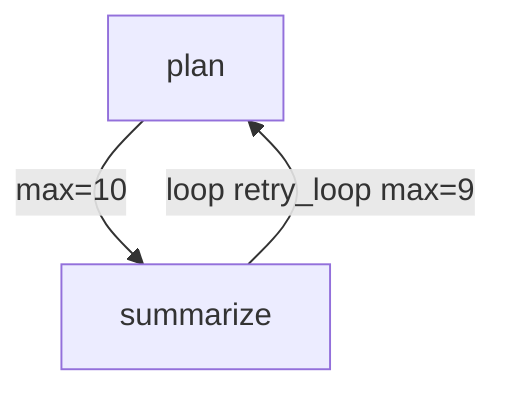
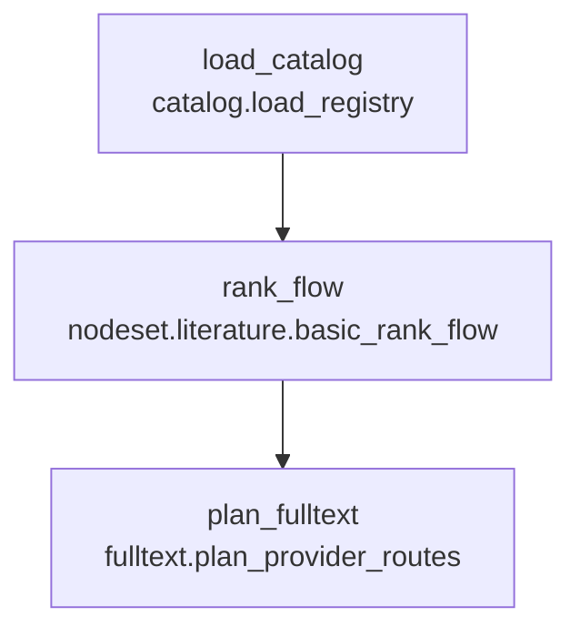
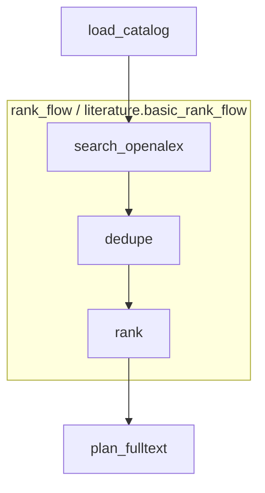

# Portable Topology Kernel With Strict Pure Node Governance

## 目标

将 Paperflow 当前 ERA-style 框架内核抽象成一个可迁移基础包。该基础包可以复制到新项目，或未来独立发布。用户只需要开发符合规范的 node，再写 JSON 配置，就可以把零散 node 组合成完整拓扑程序。

核心目标：

- 内核与业务彻底解耦。
- node 默认必须是纯函数。
- node 必须完整声明输入、输出、元数据和约束。
- node 之间禁止互相导入、依赖或直接调用。
- 复杂功能通过嵌套式 `nodes` 组合实现，而不是写巨型 node。
- plugin 可以扩展或收紧 node policy、metadata schema、health check。
- 框架提供配置合法性检查与 Mermaid 流程图导出。

## 推荐包结构

```text
src/
  topology_kernel/
    core/
      context.py
      pure_node.py
      node_contract.py
      node_metadata.py
      node_registry.py
      graph_config.py
      graph_compiler.py
      runtime.py
      trace.py
      health.py
      policy.py
      composite.py
      boundary.py
      loop_runtime.py
    plugins/
      runtime.py
      registry.py
      builtin_policies.py
    devtools/
      validator.py
      mermaid.py
      scaffold_node.py
      inspect_node.py
    resources/
      schema/
  paperflow/
    catalog/
    literature/
    fulltext/
    artifacts/
    boundary/
```

`topology_kernel` 只处理拓扑、契约、调度、校验、插件和可视化，不包含论文检索业务。

`paperflow` 只提供论文检索领域 node、全局出入口实现、资源文件和配置。

## 核心概念

### Atomic Node

最小可执行单元。必须是纯函数式 node。

建议接口：

```python
class PureNode(Protocol):
    NODE_INFO: NodeInfo
    CONTRACT: NodeContract

    def run_pure(self, inputs: Mapping[str, object], params: Mapping[str, object]) -> Mapping[str, object]:
        ...
```

原则：

- 不能直接读写 `Context`。
- 不能直接读写文件、网络、数据库、浏览器、环境变量。
- 不能调用其他 node。
- 不能依赖其他 node 的 Python 模块。
- 只能依赖标准库、框架允许的基础库、项目声明的 `base_lib`。
- 只能通过返回值报告输出。

Runtime 负责：

- 从 `Context` 提取 `requires`。
- 调用 `run_pure(inputs, params)`。
- 校验返回值是否覆盖 `provides`。
- 将输出写回 `Context`。

### Global Boundary Ports

框架不提供任何破坏纯函数规则的特殊 node 类型。

唯一例外是框架级全局出入口。全局出入口不属于 node，不进入 node registry，不受 node purity policy 约束。它是 runtime 的边界设施，只能放在拓扑执行的最前面、最后面，或受控循环的一轮边界处。

全局出入口可承担：

- 文件读写。
- 网络请求。
- 浏览器控制。
- 数据库访问。
- 用户交互。
- 长时间运行的外部进程协调。
- 将 node 输出的 request/effect/outbox 转换为真实副作用。
- 将真实世界结果写回下一轮拓扑输入。

node 与全局出入口的关系：

- node 不能直接调用全局出入口。
- node 不能持有全局出入口对象。
- node 只能通过声明的输出 key 产生请求数据，例如 `effects.http_requests`、`effects.download_requests`。
- 全局出口读取这些输出并执行真实副作用。
- 全局入口把副作用结果转换为下一次执行的输入 key，例如 `io.http_results`、`io.download_results`。

建议接口：

```python
class GlobalBoundary(Protocol):
    def before_run(self, run_config: Mapping[str, object]) -> Mapping[str, object]:
        ...

    def after_run(self, outputs: Mapping[str, object], run_config: Mapping[str, object]) -> Mapping[str, object]:
        ...

    def before_iteration(self, iteration: int, state: Mapping[str, object]) -> Mapping[str, object]:
        ...

    def after_iteration(self, iteration: int, outputs: Mapping[str, object], state: Mapping[str, object]) -> Mapping[str, object]:
        ...
```

全局出入口必须被单独审计和配置，但它不伪装成 node。

### Composite Nodes

`nodes` 是由多个 node 或其他 `nodes` 组成的复合节点。它本身也必须表现为纯函数：

- 有自己的 `name/type/category`。
- 有自己的 `requires/provides`。
- 有自己的 metadata。
- 内部通过子图组织。
- 对外只暴露声明的输入输出。
- 内部中间 key 不允许泄漏，除非显式声明 `exports`。

这样可以避免单个 node 变大，同时允许复杂功能逐层组合。

### Controlled Loop Topology

普通拓扑允许存在环路，但每个环路必须是开发者显式声明的有界环路。任意未声明 cycle 都是非法配置。

如果某个功能需要“持续运行、轮询、反馈、直到条件满足”，应通过受控循环配置表达，而不是让 node 常驻进程或互相调用。

建议配置：

```json
{
  "pipeline": {
    "nodes": [
      {"name": "plan", "type": "task.plan", "provides": ["task.requests"]},
      {"name": "summarize", "type": "task.summarize", "requires": ["task.results"], "provides": ["task.done"]}
    ],
    "edges": [
      {"from": "plan", "to": "summarize", "max_executions": 10},
      {"from": "summarize", "to": "plan", "max_executions": 9, "loop": "retry_loop"}
    ],
    "loops": [
      {
        "name": "retry_loop",
        "edges": [["summarize", "plan"]],
        "max_iterations": 9,
        "until": "task.done"
      }
    ]
  }
}
```

规则：

- `edges` 可以形成环。
- 每条边必须有 `max_executions`，或继承所属 loop 的 `max_iterations`。
- 所有 cycle 必须被 `pipeline.loops` 显式覆盖。
- 未被 `pipeline.loops` 覆盖的 cycle 一律非法。
- 每个 loop 必须声明：
  - `name`
  - `edges`
  - `max_iterations`
- loop 可以额外声明 `until`，表示某个 Context key 为 truthy 时停止。
- 反馈数据只能通过 Context key 传递。
- 跨轮副作用只能由全局出入口处理。
- node 本身仍然只执行单次纯函数调用；多次执行来自 runtime 根据有界环路重新调度。

推荐边格式：

```json
{
  "from": "node_a",
  "to": "node_b",
  "max_executions": 1,
  "loop": ""
}
```

兼容简写：

```json
["node_a", "node_b"]
```

简写边默认 `max_executions = 1`，因此只能用于非循环边。

环路 Mermaid 导出应明确标记执行次数：



### Global Boundary With Loops

有界环路与全局出入口配合时，执行模型如下：

```text
global_boundary.before_run
runtime executes bounded topology
  global_boundary.before_iteration
  pure nodes produce requests/effects
  global_boundary.after_iteration consumes requests/effects and returns next inputs
repeat until loop limit or until key
global_boundary.after_run
```

全局出入口可以让外部世界参与每轮循环，但仍不能被 node 直接调用。

## Node 必填元数据

每个 node 必须提供基础信息。可参考 ERA 的 node 开发文档，但去掉训练专用语义。

建议基础结构：

```python
@dataclass(frozen=True)
class NodeInfo:
    type_key: str
    display_name: str
    category: str
    description: str
    version: str
    purity: str
    author: str | None = None
    tags: tuple[str, ...] = ()
```

必填字段：

- `type_key`: registry key，例如 `literature.rank_records`。
- `display_name`: 可读名称。
- `category`: 功能类别。
- `description`: 简短说明。
- `version`: node 版本。
- `purity`: 默认必须是 `pure`。

建议 contract：

```python
@dataclass(frozen=True)
class NodeContract:
    requires: tuple[str, ...]
    provides: tuple[str, ...]
    input_semantics: Mapping[str, tuple[str, ...]]
    output_semantics: Mapping[str, tuple[str, ...]]
    params_schema: Mapping[str, object]
    output_schema: Mapping[str, object]
```

可选元数据：

- `cacheable`
- `deterministic`
- `max_input_size`
- `max_output_size`
- `estimated_time_cost`
- `estimated_memory_mb`
- `allowed_base_libs`

## 纯函数强约束机制

Python 无法完全证明任意函数纯净，但内核可以采用多层强约束。只要任一层失败，node 即判为非法。

### 1. 接口限制

node 只能实现 `run_pure(inputs, params) -> outputs`。

禁止：

- `run(context, ...)`
- 直接持有 `Context`
- 在 node 中接收 boundary、session、browser、database connection

### 2. AST 静态检查

检查 node 源码 AST。

禁止调用：

- `open`
- `Path.write_text`
- `Path.write_bytes`
- `Path.unlink`
- `Path.rename`
- `requests.*`
- `httpx.*`
- `sqlite3.connect`
- `subprocess.*`
- `os.system`
- `os.environ.__setitem__`
- `shutil.rmtree`
- `socket.*`
- `playwright`
- `nodriver`
- `camoufox`

禁止语法或模式：

- module-level mutable global。
- 对 global/nonlocal 的写入。
- monkey patch。
- 动态 import。
- `eval` / `exec`。
- 直接导入其他 node 模块。

### 3. Import 白名单

默认允许：

- Python 标准库中无副作用模块。
- `topology_kernel.base_lib`。
- 项目配置声明的 `base_lib`。

默认禁止：

- 导入同项目其他 node 文件。
- 导入全局出入口实现层。
- 导入网络、浏览器、数据库、文件写入相关库。

### 4. Runtime 冻结检查

Runtime 调用前：

- 深拷贝 inputs。
- 计算 JSON-safe snapshot 或 hash。

Runtime 调用后：

- 确认 inputs 未被原地修改。
- 确认 outputs 只包含 contract 声明的 key。
- 确认 required outputs 都存在。
- 确认 outputs 可以 JSON snapshot，除非 schema 允许特殊对象。

### 5. 文件大小限制

内核提供代码文件大小 policy。

默认建议：

```json
{
  "policy": {
    "node_source": {
      "max_lines": 500,
      "max_bytes": 60000
    }
  }
}
```

如果 node 定义文件超过限制：

- 默认判为 health error。
- 可通过 plugin 降级为 warning，但必须显式配置。
- 建议拆分为多个小 node，再用 `nodes` 组合。

### 6. Node 间依赖禁止

硬规则：

- node A 不允许 import node B。
- node A 不允许调用 node B。
- node A 不允许读取 node B 的内部常量。
- node A 与 node B 只能通过 `Context` key 和配置拓扑发生关系。

允许：

- 所有 node 共同依赖 `base_lib`。
- 所有 node 使用 domain model、纯函数工具、schema 定义。

推荐结构：

```text
paperflow/
  base_lib/
    text.py
    ids.py
    records.py
    pdf_rules.py
  literature/
    nodes/
      search_openalex.py
      rank_records.py
```

`base_lib` 必须自己也通过 purity/import 检查。

## Plugin 扩展点

plugin 不只是 runtime hook，还应能扩展框架治理策略。

### Policy Plugin

可以修改或追加 node 限制。

示例：

- 要求所有 node 声明 `estimated_memory_mb`。
- 要求所有 fulltext node 声明 `network_policy`。
- 将 `max_lines` 从 500 改为 300。
- 允许某个项目使用 `numpy` 或 `pandas`。

接口草案：

```python
class PolicyPlugin(Protocol):
    name: str
    priority: int

    def extend_node_metadata_schema(self, schema: MetadataSchema) -> MetadataSchema:
        ...

    def extend_contract_schema(self, schema: ContractSchema) -> ContractSchema:
        ...

    def extend_purity_rules(self, rules: PurityRules) -> PurityRules:
        ...

    def validate_node(self, node: NodeDescriptor) -> list[HealthFinding]:
        ...
```

### Runtime Plugin

负责运行期事件：

- run start/end。
- node start/end。
- composite enter/exit。
- trace。
- manifest。
- cache。
- GUI progress。

### Compiler Plugin

负责编译期行为：

- graph optimizer。
- auto data edge policy。
- conflict policy。
- semantic compatibility。
- schema expansion。

## 嵌套式配置设计

配置应支持 atomic node 和 composite nodes。

### 配置 A: 定义一个 composite nodes

```json
{
  "nodesets": [
    {
      "name": "literature.basic_rank_flow",
      "version": "0.1.0",
      "display_name": "Basic Literature Ranking Flow",
      "category": "literature",
      "description": "Search, dedupe, match and rank literature records.",
      "purity": "pure",
      "requires": ["catalog.venues", "query.text"],
      "provides": ["literature.ranked_records"],
      "exports": ["literature.ranked_records"],
      "pipeline": {
        "nodes": [
          {
            "name": "search_openalex",
            "type": "literature.search_openalex",
            "requires": ["catalog.venues", "query.text"],
            "provides": ["literature.openalex_records"]
          },
          {
            "name": "dedupe",
            "type": "literature.merge_dedupe",
            "requires": ["literature.openalex_records"],
            "provides": ["literature.merged_records"]
          },
          {
            "name": "rank",
            "type": "literature.rank_records",
            "requires": ["literature.merged_records", "query.text"],
            "provides": ["literature.ranked_records"]
          }
        ]
      }
    }
  ]
}
```

### 配置 B: 像普通 node 一样使用 nodes

```json
{
  "pipeline": {
    "nodes": [
      {
        "name": "load_catalog",
        "type": "catalog.load_registry",
        "provides": ["catalog.venues"]
      },
      {
        "name": "rank_flow",
        "type": "nodeset.literature.basic_rank_flow",
        "requires": ["catalog.venues", "query.text"],
        "provides": ["literature.ranked_records"]
      },
      {
        "name": "plan_fulltext",
        "type": "fulltext.plan_provider_routes",
        "requires": ["literature.ranked_records"],
        "provides": ["fulltext.provider_routes"]
      }
    ]
  }
}
```

### 嵌套规则

- `nodeset` 可以包含 atomic node。
- `nodeset` 可以包含其他 `nodeset`。
- 必须防止递归引用。
- 内部 key 默认局部化。
- 对外只允许暴露 `exports`。
- 外部图只看到 composite 的 `requires/provides`。
- Mermaid 导出时可以选择展开或折叠。

## 配置合法性检查

内核应提供：

```text
topology validate --config workflow.json
topology inspect-node --type literature.rank_records
topology inspect-config --config workflow.json
```

必须检查：

- JSON schema 合法。
- 所有 node type 可解析。
- 所有 node metadata 完整。
- 所有 contract 完整。
- `requires/provides` 可解析。
- 所有 cycle 都被 `pipeline.loops` 显式声明并具备执行次数上限。
- 未声明 cycle 一律非法。
- composite 无递归。
- composite exports 合法。
- node purity 合法。
- node source 文件大小合法。
- node 之间无 import/call 依赖。
- plugin policy 全部满足。

输出建议：

```json
{
  "status": "failed",
  "errors": [],
  "warnings": [],
  "graph": {
    "explicit_edges": [],
    "data_edges": [],
    "effective_edges": []
  },
  "nodes": {},
  "nodesets": {}
}
```

## Mermaid 导出

内核应提供：

```text
topology export-mermaid --config workflow.json --output graph.mmd
topology export-mermaid --config workflow.json --expand-nodesets
topology export-mermaid --config workflow.json --collapse-nodesets
```

折叠模式：



展开模式：



导出选项：

- `expand_nodesets: true | false`
- `show_contract_keys: true | false`
- `show_semantics: true | false`
- `show_policy_findings: true | false`
- `show_boundary_ports: true | false`

## 全局出入口与现实副作用

论文检索项目不可避免需要副作用：

- HTTP 检索。
- PDF 下载。
- 浏览器探索。
- 文件写入。
- SQLite memory。

建议处理方式：

1. 内核默认全部 node 必须 pure。
2. 不允许创建任何副作用 node。
3. 副作用能力只能进入全局出入口。
4. node 通过输出 request/effect/outbox 数据表达意图。
5. 全局出口执行副作用。
6. 全局入口把结果转为下一轮输入。
7. graph health 必须标记所有依赖全局出入口的 key。

这样不会否定实际需求，但会让副作用保持在框架边界，而不是污染 node 体系。

示例：

```json
{
  "boundary": {
    "type": "paperflow.global_boundary",
    "config": {
      "run_dir": "runs/paperflow/demo",
      "network": {"proxy": ""},
      "browser": {"engine": "camoufox", "headless": true}
    }
  },
  "pipeline": {
    "nodes": [
      {
        "name": "plan_requests",
        "type": "fulltext.plan_download_requests",
        "requires": ["literature.ranked_records"],
        "provides": ["effects.download_requests"]
      },
      {
        "name": "summarize_results",
        "type": "fulltext.summarize_download_results",
        "requires": ["io.download_results"],
        "provides": ["fulltext.outcomes"]
      }
    ],
    "edges": [
      {"from": "plan_requests", "to": "summarize_results", "max_executions": 5}
    ],
    "loops": []
  }
}
```

这里 `plan_requests` 和 `summarize_results` 都仍然是纯函数。下载动作只发生在全局出入口中。

## 推荐实施顺序

### P0: 抽出内核边界

1. 新增 `topology_kernel` 包。
2. 从 `paperflow.core` 迁移通用代码。
3. 让 `paperflow` 作为 domain package 依赖内核。

### P1: PureNode 强约束

1. 新增 `PureNode`。
2. Runtime 改为 `inputs -> outputs` 调用模型。
3. Context mutation 只允许 runtime 做。
4. 增加 AST purity checker。
5. 增加 source size checker。

### P2: Metadata 与 policy plugin

1. 定义 `NodeInfo`。
2. 定义 `MetadataSchema`。
3. 定义 `PolicyPlugin`。
4. 默认 policy 要求 node metadata 完整。

### P3: Composite Nodes

1. 定义 `nodeset` 配置格式。
2. 编译期把 nodeset 当 node 使用。
3. 支持展开和折叠。
4. 禁止递归引用。
5. 检查 exports。

### P4: Validator 与 Mermaid

1. `validate` CLI。
2. `inspect-node` CLI。
3. `export-mermaid` CLI。
4. 输出 JSON health report。

### P5: Paperflow 迁移

1. 将 catalog/literature/fulltext/artifacts node 改造成 `PureNode`。
2. 副作用逻辑迁移到 Paperflow 全局出入口。
3. 为 Paperflow 写 policy plugin。
4. 将复杂功能改成 nodeset。

## 风险与限制

- Python 纯函数检查无法做到数学绝对证明，只能做到工程上足够强的限制。
- 过强限制会降低开发速度，需要 scaffold 和 validator 让开发反馈足够快。
- 全局出入口权力很大，必须单独审计；但它不能注册为 node，也不能被 node 直接调用。
- 受控 loop 必须有最大迭代次数或明确停止条件，否则会把配置错误变成运行期死循环。
- nodeset 的 key 作用域必须设计清楚，否则嵌套后容易发生 key 泄漏或冲突。

## 最终形态

理想状态下，一个项目只需要：

```text
my_project/
  base_lib/
  nodes/
  nodesets/
  configs/
```

开发者：

1. 写小型纯函数 node。
2. 用 nodeset 组织复杂功能。
3. 用 JSON 组织最终拓扑。
4. 用 validator 检查合法性。
5. 用 Mermaid 导出结构图。
6. 用 runtime 执行。

框架负责强制维护边界，避免后期变成互相调用、隐式依赖、巨型函数和不可维护副作用的集合。
